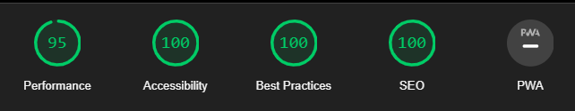

# s-public


> [!IMPORTANT]
> This is the source code of [s-hirano.com](https://s-hirano.com/).
> It consists of a portfolio and a blog which summarizes the knowledge I gained over the years.

## ✅ Lighthouse Score



## 💻 Tech Stack

**Main Framework** - [Astro](https://astro.build/)  
**Type Checking** - [TypeScript](https://www.typescriptlang.org/)  
**Component Framework** - [ReactJS](https://reactjs.org/)  
**Package Manager** - [pnpm](https://pnpm.io/)  
**Styling** - [TailwindCSS](https://tailwindcss.com/) | [DaisyUI](https://daisyui.com/)  
**Icons** - [Boxicons](https://boxicons.com/) | [Tablers](https://tabler-icons.io/)  
**Fonts** - [Google Fonts](https://fonts.google.com/)  
**Code Formatting** - [Prettier](https://prettier.io/)  
**Linting** - [ESLint](https://eslint.org)  
**Markdown Linting** - [markdownlint-cli2](https://github.com/DavidAnson/markdownlint-cli2)  
**CSS Linting** - [Stylelint](https://stylelint.io/)  
**Secret linting** - [secretlint](https://github.com/secretlint/secretlint)  
**Auto Commit Rejection** - [Husky](https://typicode.github.io/husky/) | [lint-staged](https://github.com/lint-staged/lint-staged)  
**Package updates** - [Renovate](https://www.mend.io/renovate/)  
**HTML checker** - [Nu Html Checker](https://github.com/validator/validator)  
**Lighthouse** - [LightHouse](https://developers.google.com/web/tools/lighthouse)  
**Visual regression** - [Playwright test](https://playwright.dev/docs/test-intro/)  
**SVG optimization** - [svgo](https://github.com/svg/svgo)  
**Vulnerabilities Check** - [pnpm audit](https://pnpm.io/cli/audit) | [Dependabot alert](https://docs.github.com/ja/code-security/dependabot/dependabot-alerts/about-dependabot-alerts)

### My infrastructure stack

**Version Management** - [GitHub](https://github.com/)  
**Deployment** - [Cloudflare Pages](https://www.cloudflare.com/ja-jp/developer-platform/products/pages/)  
**Analytics** - [Google Analytics](https://analytics.google.com/analytics/web/)  
**Search Console** - [Google Search Console](https://search.google.com/search-console)  
**Domain** - [Onamae.com](https://www.onamae.com/)

## 🍾 Setups

### Initial setups

```bash
git clone https://github.com/s-hirano-ist/s-public.git
pnpm install
```

### Adding photos

Add photos to `./src/data/assets/photo/` and run:

```bash
pnpm generate:photo
```

### Update books

```bash
pnpm generate:book
```

### Update licenses

```bash
pnpm license:json
pnpm license:summary
```

### Check for inappropriate licenses

```bash
bash checkLicense.sh
```

### Cloudflare deployment

Add GitHub integration for auto-deployment on Cloudflare.

### Google Site Verification (optional)

Access [Google Search Console](https://search.google.com/search-console) and publish "google-site-verification" tag.
Access [Onamae.com](https://www.onamae.com/) to add DNS TXT record.

## ☀ Favicon

- Text: S
- Background: Rounded
- Font Family: Geostar Fill
- Font Variant: Regular 400 Normal
- Font Size: 110
- Font Color: #77A2C0

> <https://favicon.io/favicon-generator/>

## 🧞 Commands

All commands are run from the root of the project, from a terminal:

| Command                 | Action                                         |
| :---------------------- | :--------------------------------------------- |
| `pnpm install`          | Installs dependencies                          |
| `pnpm check`            | Check Astro types                              |
| `pnpm dev`              | Starts local dev server at `localhost:4321`    |
| `pnpm build`            | Build production site to `./dist`              |
| `pnpm preview`          | Preview build locally                          |
| `pnpm tsc`              | Check types with TypeScript                    |
| `pnpm fmt`              | Check code format with Prettier                |
| `pnpm fmt:fix`          | Format codes with Prettier                     |
| `pnpm lint`             | Lint with ESLint                               |
| `pnpm lint:fix`         | Fix lint with ESLint                           |
| `pnpm lint:mark`        | Lint markdown files with markdownlint-cli2     |
| `pnpm lint:mark:fix`    | Fix lint markdown files with markdownlint-cli2 |
| `pnpm lint:css`         | Lint CSS files with Stylelint                  |
| `pnpm lint:css:fix`     | Fix lint CSS files with Stylelint              |
| `pnpm lint:secret`      | Lint secrets with secretlint                   |
| `pnpm generate:book`    | Generate book data using Google Books API      |
| `pnpm generate:photo`   | Generate photo paths                           |
| `pnpm license:summary`  | Generate license summary                       |
| `pnpm license:json`     | Generate license JSON                          |
| `pnpm security`         | Security check with pnpm audit                 |
| `pnpm snapshots`        | Run visual regression tests with Playwright    |
| `pnpm snapshots:update` | Update visual regression snapshots             |

## 🪝 Tags & Release

1. Update version in `package.json`

2. Run the following command

```bash
gh release create --generate-notes
```

## 📜 License

Licensed under the MIT License, Copyright © 2024

### Licenses of used libraries

See `license.summary.txt` for summary of used licenses.
