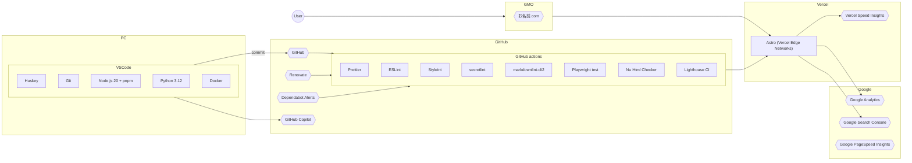

# Blog

共通で利用している開発環境と[s-hirano-ist's blog](https://github.com/s-hirano-ist/blog)の構成。

```mermaid
flowchart LR

subgraph Vercel
  Astro["Astro (Vercel Edge Networks)"]-->VSI{{"Vercel Speed Insights"}}
end
subgraph Google
  GAL{{"Google Analytics"}}
  GSC{{"Google Search Console"}}
  PSI{{"Google PageSpeed Insights"}}
end
subgraph GMO
  onamae{{"お名前.com"}}
end
subgraph GitHub
  GH{{"GitHub"}}-->GA
  RV{{"Renovate"}}-->GA
  DA{{"Dependabot Alerts"}}-->GA
  GC{{"GitHub Copilot"}}
  subgraph GA["GitHub actions"]
    Prettier
    ESLint
    Styleint
    secretlint
    markdownlint-cli2
    Playwright["Playwright test"]
    Nu["Nu Html Checker"]
    lighthouse["Lighthouse CI"]
  end
end
subgraph PC
  subgraph VSCode
    Huskey
    Git
    JS["Node.js 20 + pnpm"]
    Python["Python 3.12"]
    Docker
  end
end

VSCode-->|commit|GH
VSCode-->GC
Astro-->GAL
Astro-->GSC
GMO-->Astro
GA-->Astro
User((User))-->GMO
```
