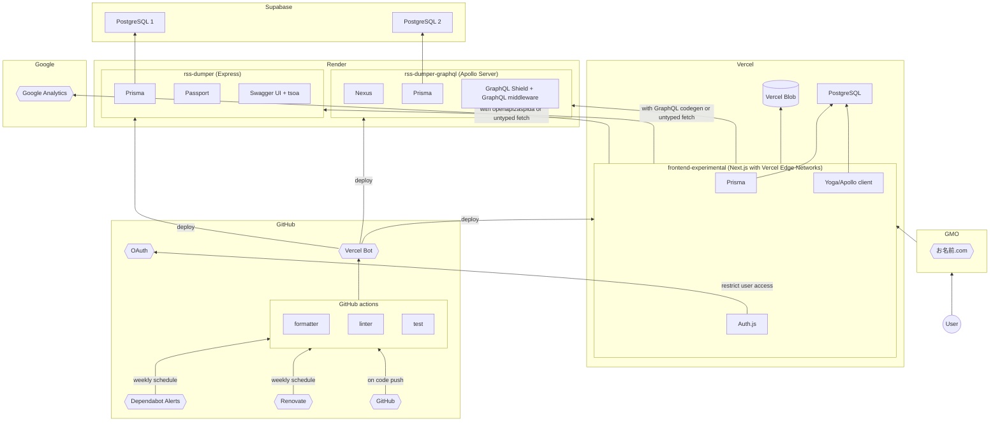

# Experimental

Deployment of [frontend-experimental](https://github.com/s-hirano-ist/frontend-experimental), [rss-dumper](https://github.com/s-hirano-ist/rss-dumper), and [rss-dumper-graphql](https://github.com/s-hirano-ist/rss-dumper-graphql)

